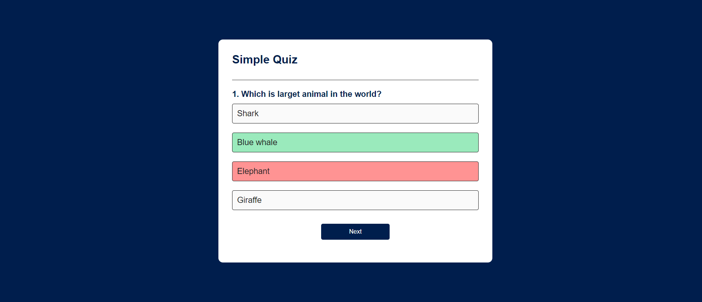

# Simple Quiz App 🧠🌍

Welcome to the Simple Quiz App! Test your knowledge about the world with this interactive and engaging quiz application. Challenge yourself with a variety of intriguing questions on topics ranging from animals and geography to history and more.



## Features

- **Interactive Quizzes**: Engage in fun and educational quizzes that will test your knowledge and keep you entertained.
- **Real-time Feedback**: Instantly know whether your answer is correct or incorrect and see your score as you progress.
- **Randomized Questions**: Enjoy a unique experience each time you play with dynamically generated questions.
- **Responsive Design**: Seamlessly play on any device, from your desktop computer to your mobile phone.

## Technology Stack

This project was built using the following technologies and tools:

- HTML: Structure and content of the web pages.
- CSS: Styling and layout of the app for a visually appealing experience.
- JavaScript: Implementation of interactive features and functionalities.
- GitHub: Version control and collaboration platform.

## Getting Started

1. Clone the repository:
   ```bash
   git clone https://github.com/chhote04/simple-quiz-app.git
   ```

2. Navigate to the project directory:
   ```bash
   cd simple-quiz-app
   ```

3. Open the `quiz.html` file in your preferred web browser to start playing the quiz.

## How to Play

1. Read the question presented at the top of the screen.
2. Click on the answer you believe is correct.
3. Instantly receive feedback on whether your answer is right or wrong.
4. Your score will be displayed at the top of the screen.
5. Click the "Next" button to move on to the next question.

# Live Demo

Check out the live version of the app: [Live Demo](https://adwebtechnology.com/weather/quiz.html)

## Contribution

If you find any issues or have suggestions for improvement, feel free to open an issue or submit a pull request. Your contributions are highly appreciated!

## Acknowledgments

The app developement is inspired by GreatStackDev .
GreatStack for https://www.youtube.com/@GreatStackDev.


## Contact

Connect with me on LinkedIn: [Your LinkedIn Profile](https://www.linkedin.com/in/chhote-lal-jatav-a37982249/)

